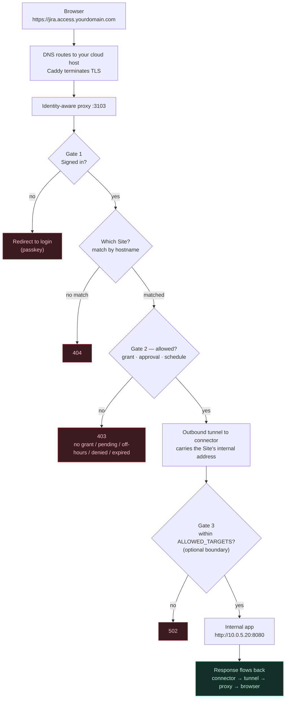

# How Captivo Access works

A plain walkthrough: first how the pieces fit together and how you set them up,
then the exact path a single request takes from a vendor's browser to an
internal web app — and every gate it passes through on the way.

Captivo Access gives outside users **time-boxed, audited access to specific
internal web apps** — without a VPN, without opening inbound ports, and without
ever exposing the apps' real addresses.

---

## Setup, in plain terms

The whole thing is **two pieces**:

| Piece | Where it runs | What it is |
|---|---|---|
| **Manager** | your cloud (internet-facing) | The front door: identity (passkey/SSO), the admin console, and the access policy. Admins sign in at this address; vendors don't — they reach per-app hostnames served by a companion identity-aware proxy (below). |
| **Connector** | deep inside your network | A small agent that dials **outbound only** — no inbound port is ever opened to it. It's the only thing that reaches your internal apps, and their real addresses never leave your network. |

Setting it up:

1. **Prepare a server and a subdomain.** A cloud server, and a subdomain
   pointing at it (`access.yourdomain.com`). Set up DNS the safe way — if it's a
   subdomain of a domain you already use for a site or email, delegate *just*
   that subdomain (see [`deploy/README.md`](../deploy/README.md)); never move the
   parent domain's nameservers.
2. **Install Captivo Access.** One `docker compose … up -d` on the server brings
   up the Manager, its database, and the proxy, with automatic HTTPS. Nothing to
   build — it pulls the published images.
3. **Create the first admin.** Open `manager.access.yourdomain.com/setup` and
   register yourself with a **passkey**. No passwords — your device is the key.
4. **Install a connector inside your network.** In the admin console you create a
   connector and get a ready-to-run `docker run` command. Run it on a machine
   inside your network; it dials out and shows up as online.
5. **Define two things: the app, and who.** A **Site** = which internal app
   (e.g. `jira.access.yourdomain.com` → the app's real internal address, set
   directly on the Site — the connector itself needs no per-app config; it
   just dials whatever address the Site sends it, optionally bounded by
   `ALLOWED_TARGETS` on the connector's container).
   An **access grant** = invite the user (they register a passkey) and grant them
   that Site — optionally time-boxed, approval-gated, or on a recurring schedule
   ("weekdays 09:00–18:00").
6. **Done.** The user signs in from their browser and reaches only the apps
   they're allowed to.

---

## The journey of a single request

**Scenario:** a vendor types `jira.access.yourdomain.com` into their browser.
Every request travels this path. A solid arrow is the path continuing; a
branch labelled **no** is a rule that stops the request.

Step by step:

1. **The browser opens the address.** `jira.access.yourdomain.com` is a public
   *front-door* name you invented — not the real Jira address.
2. **DNS + TLS.** DNS sends that name to your cloud host, where **Caddy**
   terminates HTTPS. The real internal addresses never touch public DNS.
3. **The proxy receives it.** All `*.access.yourdomain.com` traffic lands on one
   identity-aware proxy. From here, three gates.
4. **Gate 1 — Signed in?** The proxy looks for a valid session cookie (has the
   user signed in with their passkey?). **If not → redirect to login**; after the
   passkey ceremony the user returns to where they were.
5. **Which Site?** The proxy matches the request's hostname to a defined **Site**.
   **No matching Site → 404.** An address you never defined leads nowhere.
6. **Gate 2 — Allowed?** The real decision (`evaluateAccess`): does this user have
   a **grant** for this Site — is it **approved**, and within its **time window**
   and **recurring schedule**? **If not → 403**, with a specific reason: no grant,
   pending approval, outside hours, denied, or expired.
7. **Outbound tunnel.** The proxy sends the request, along with the Site's
   internal address, through the connector's **outbound-only** tunnel. The
   cloud never dials into your network — the connector always opened the
   connection.
8. **Gate 3 — Within the boundary?** The connector dials the internal address
   defined on the Site (`http://10.0.5.20:8080`). If the connector's container
   has an optional `ALLOWED_TARGETS` boundary set, the address must fall
   inside it. **Outside it → 502.** Left unset, the connector dials whatever
   address the Manager routes to it.
9. **The internal app responds.** Jira (or whatever it is) sees the request and
   produces its response, as if the user were on the internal network.
10. **The response flows back** — connector → tunnel → proxy → Caddy → browser.
    The user sees Jira. They never "entered" the network; they only spoke to the
    one app they're allowed to, from behind the gates.

> **And all of it is recorded.** Every allow and every deny on this path is
> written to an append-only, hash-chained audit log — who, when, which app, which
> decision. That tamper-evident trail is what backs the compliance story
> (KVKK / Law No. 5651).

> **A few variations on the same path.** WebSocket apps (e.g. a browser-based
> console) are relayed the same way; **web sessions can be recorded** per Site
> and replayed in the console; internal staff/admins can optionally sign in via
> **SSO/OIDC** instead of a passkey; and **RDP/SSH/VNC** sessions are served by a
> native remote-desktop gateway bundled with the connector — recorded for later
> replay and watchable live by an admin (who can also take control). Who can do what
> in the console is governed by five roles (`ADMIN`, `OPERATOR`, `AUDITOR`,
> `STAFF`, `VENDOR`).

> **Extra policy gates (optional).** Gate 2 can carry more than the grant: a
> **source-IP allowlist** rejects access from networks you didn't approve, a
> **maximum grant duration** stops anyone handing out never-expiring access, and
> **session limits** (idle / max-lifetime / concurrency) bound the login itself.
> All of these live on the console's **Policy** page and apply live.

---

See also: [`deploy/README.md`](../deploy/README.md) for the full production
deploy (DNS, TLS, connector install), and the root
[`README.md`](../README.md) for the architecture overview.
